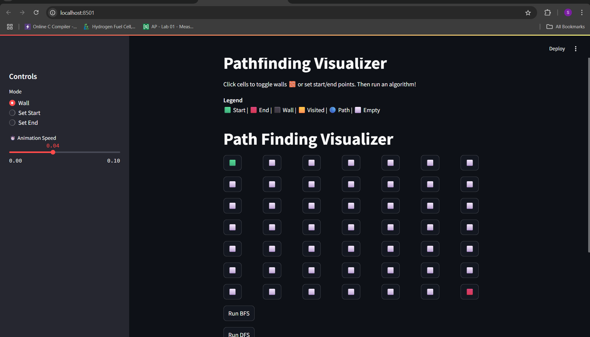

# Pathfinding Visualizer

An interactive web-based tool built with Streamlit that visualizes popular pathfinding algorithms like BFS, DFS, Dijkstra, and A* in real-time. Users can draw walls, set start and end points, and watch the algorithm explore the grid.


## Demo 

Check the demo of UI 


## Features
- Build custom mazes using Wall Mode

- Set custom Start and End nodes

-  Visualize:

    - Breadth First Search (BFS)

    - Depth First Search (DFS)

    - Dijkstra's Algorithm

    - A* (A-Star) Algorithm

- Step-by-step animation of the search and path reconstruction

- Clean and intuitive UI using Streamlit

## How to Use
1. Launch the app using Streamlit:

```bash
streamlit run app.py

```
2. Select Wall, Set Start, or Set End mode.

3. Click on grid cells to build your maze or set positions.

4. Choose an algorithm and click Run.

5. Watch it animate the search and final path.

6. Use Reset Grid to clear and try again!

## Tech Stack
| Technology | Purpose                                 |
|------------|------------------------------------------|
| Python     | Core logic implementation               |
| Streamlit  | Frontend interface and interactivity    |
| `heapq`    | Priority queue for A* and Dijkstra      |
| `collections` | Queue for BFS and stack for DFS     |

## Scope of Improvements
- Add support for larger custom grids

- Implement more algorithms (Greedy, Bidirectional)

- Add maze generators

- Enable dynamic speed control

- Optimize animation timing and UI responsiveness